# QEmbed Architecture Documentation

## Table of Contents

1. [System Overview](#system-overview)
2. [Architecture Principles](#architecture-principles)
3. [High-Level Architecture](#high-level-architecture)
4. [Implementation Status](#implementation-status)
5. [Core Components](#core-components)
6. [Model Architecture](#model-architecture)
7. [Training Framework](#training-framework)
8. [Data Pipeline](#data-pipeline)
9. [Evaluation System](#evaluation-system)
10. [Utility Infrastructure](#utility-infrastructure)
11. [Integration Points](#integration-points)
12. [Performance Considerations](#performance-considerations)
13. [Security & Privacy](#security--privacy)
14. [Deployment Architecture](#deployment-architecture)
15. [Future Architecture](#future-architecture)

## System Overview

QEmbed is a quantum-inspired natural language processing library that leverages quantum computing principles to create enhanced embeddings. The system architecture is designed around the concept of **superposition states**, **quantum entanglement**, and **contextual collapse** to capture the inherent uncertainty and polysemy in natural language.

> **📋 Implementation Status Note**: This architecture document reflects the current implementation state of QEmbed. Some components mentioned in the diagram are fully implemented, while others are planned or in development. The diagram has been updated to accurately represent the current codebase.

### Key Architectural Goals

- **Quantum-Inspired Design**: Leverage quantum computing principles for NLP
- **BERT Compatibility**: Seamless integration with Hugging Face Transformers
- **Modular Architecture**: Clean separation of concerns with well-defined interfaces
- **Extensibility**: Easy addition of new quantum-inspired components
- **Performance**: Optimized for both training and inference
- **Research-Friendly**: Designed for experimentation and research

## Architecture Principles

### 1. **Quantum-Classical Hybrid Design**

- Quantum-inspired algorithms running on classical hardware
- Superposition states represented as probability distributions
- Entanglement modeled through correlation matrices
- Measurement operations for state collapse

### 2. **Modular Component Architecture**

- Each component has a single, well-defined responsibility
- Loose coupling between modules
- Clear interfaces and contracts
- Easy to test, debug, and extend

### 3. **BERT-First Integration**

- Built on top of Hugging Face Transformers
- Maintains compatibility with existing BERT workflows
- Gradual quantum enhancement without breaking changes

### 4. **Research-Driven Design**

- Experimental components clearly marked
- Easy to enable/disable quantum features
- Comprehensive evaluation and analysis tools

## High-Level Architecture


```mermaid
graph TB
    %% Input Processing Layer
    subgraph "Input Processing Layer"
        A[Text Input] --> B[Tokenization]
        B --> C[Initial Embeddings]
        C --> C1[Word Embeddings]
        C --> C2[Position Embeddings]
        C --> C3[Token Type Embeddings]
    end
    
    %% Quantum Core Processing
    subgraph "Quantum Core Processing"
        subgraph "Quantum Embeddings"
            D[Quantum Embeddings] --> D1[Superposition Creation]
            D1 --> D2[State Initialization]
            D2 --> D3[Amplitude Management]
        end
        
        subgraph "Superposition Management"
            E[Superposition States] --> E1[Multi-State Representation]
            E1 --> E2[State Evolution]
            E2 --> E3[Coherence Maintenance]
        end
        
        subgraph "Entanglement System"
            F[Entanglement Layer] --> F1[Bell State Entanglement]
            F1 --> F2[GHZ State Entanglement]
            F2 --> F3[Custom Entanglement]
            F3 --> F4[Correlation Matrices]
        end
        
        subgraph "Context Processing"
            G[Context Collapse] --> G1[Attention-Based Collapse]
            G1 --> G2[Convolutional Collapse]
            G2 --> G3[RNN-Based Collapse]
            G3 --> G4[Adaptive Collapse]
        end
        
        subgraph "Measurement Operations"
            H[Quantum Measurement] --> H1[Computational Basis]
            H1 --> H2[Bell Basis]
            H2 --> H3[Custom Basis]
            H3 --> H4[Weak Measurement]
            H4 --> H5[POVM Measurement]
        end
    end
    
    %% Model Integration Layer
    subgraph "Model Integration Layer"
        subgraph "BERT Integration"
            I[BERT/Transformer Models] --> I1[QuantumBertModel]
            I1 --> I2[QuantumBertForSequenceClassification]
            I2 --> I3[QuantumBertForMaskedLM]
            I3 --> I4[QuantumBertEmbeddings]
        end
        
        subgraph "Custom Transformers"
            I --> I5[QuantumTransformer]
            I5 --> I6[QuantumTransformerEmbeddings]
            I6 --> I7[QuantumTransformerLayer]
            I7 --> I8[QuantumMultiHeadAttention]
        end
        
        subgraph "Hybrid Models"
            I --> I9[HybridModel]
            I9 --> I10[HybridEmbeddingLayer]
            I10 --> I11[HybridAttention]
            I11 --> I12[HybridTransformerLayer]
        end
        
        subgraph "Task-Specific Heads"
            J[Task-Specific Heads] --> J1[Classification Head]
            J1 --> J2[MLM Head]
            J2 --> J3[Embedding Head]
            J3 --> J4[Custom Task Head]
        end
    end
    
    %% Training Framework
    subgraph "Training Framework"
        subgraph "Quantum Trainer"
            K[Quantum Trainer] --> K1[Superposition Scheduling]
            K1 --> K2[Entanglement Training]
            K2 --> K3[Uncertainty Regularization]
            K3 --> K4[Quantum-Aware Validation]
        end
        
        subgraph "Loss Functions"
            L[Quantum Loss Functions] --> L1[SuperpositionLoss]
            L1 --> L2[EntanglementLoss]
            L2 --> L3[UncertaintyLoss]
        end
        
        subgraph "Optimization"
            M[Quantum Optimizers] --> M1[SuperpositionOptimizer]
            M1 --> M2[EntanglementOptimizer]
            M2 --> M3[Adaptive Learning Rates]
        end
        
        subgraph "Training Loop"
            N[Training Loop] --> N1[Forward Pass]
            N1 --> N2[Loss Calculation]
            N2 --> N3[Backward Pass]
            N3 --> N4[Parameter Updates]
            N4 --> N5[Validation]
        end
    end
    
    %% Data Pipeline
    subgraph "Data Pipeline"
        subgraph "Specialized Datasets"
            O[Polysemy Datasets] --> O1[PolysemyDataset]
            O1 --> O2[WordSenseDisambiguationDataset]
            O2 --> O3[Contextual Ambiguity Data]
            O3 --> O4[Multi-Sense Corpora]
        end
        
        subgraph "Data Loading"
            P[Quantum Data Loaders] --> P1[QuantumDataLoader]
            P1 --> P2[UncertaintyDataLoader]
        end
        
        subgraph "Data Processing"
            Q[Batch Processing] --> Q1[Quantum-Aware Batching]
            Q1 --> Q2[Uncertainty-Based Sampling]
            Q2 --> Q3[Entanglement-Aware Grouping]
            Q3 --> Q4[Superposition State Management]
        end
        
        subgraph "Data Augmentation"
            R[Data Augmentation] --> R1[Quantum State Perturbation]
            R1 --> R2[Entanglement Enhancement]
            R2 --> R3[Superposition Variation]
            R3 --> R4[Context-Aware Augmentation]
        end
    end
    
    %% Evaluation System
    subgraph "Evaluation System"
        subgraph "Base Evaluation"
            S[Base Evaluation Framework] --> S1[BaseEvaluator]
            S1 --> S2[EvaluationMetrics]
            S2 --> S3[Common Metrics]
        end
        
        subgraph "Task-Specific Evaluation"
            T[Task-Specific Evaluators] --> T1[ClassificationEvaluator]
            T1 --> T2[MLMEvaluator]
            T2 --> T3[EmbeddingEvaluator]
            T3 --> T4[Custom Task Evaluator]
        end
        
        subgraph "Quantum Analysis"
            U[Quantum Analysis Tools] --> U1[QuantumEvaluation]
            U1 --> U2[UncertaintyAnalyzer]
            U2 --> U3[SuperpositionAnalyzer]
        end
        
        subgraph "Advanced Evaluation"
            V[Advanced Evaluation] --> V1[EvaluationPipeline]
            V1 --> V2[EvaluationReporter]
            V2 --> V3[ModelComparator]
        end
    end
    
    %% Utility Infrastructure
    subgraph "Utility Infrastructure"
        subgraph "Quantum Utilities"
            W[Quantum Utils] --> W1[Quantum State Manipulation]
            W1 --> W2[Entanglement Calculations]
            W2 --> W3[Measurement Operations]
            W3 --> W4[Quantum Circuit Simulation]
        end
        
        subgraph "Metrics & Analysis"
            X[Metrics & Analysis] --> X1[Classical NLP Metrics]
            X1 --> X2[Quantum-Specific Metrics]
            X2 --> X3[Uncertainty Quantification]
            X3 --> X4[Performance Analysis]
            X4 --> X5[Entanglement Measures]
        end
        
        subgraph "Visualization Tools"
            Y[Visualization Tools] --> Y1[Quantum State Visualization]
            Y1 --> Y2[Training Progress Plots]
            Y2 --> Y3[Uncertainty Heatmaps]
            Y3 --> Y4[Entanglement Networks]
            Y4 --> Y5[Superposition State Plots]
        end
        
        subgraph "Configuration & Management"
            Z[Configuration Management] --> Z1[Model Configuration]
            Z1 --> Z2[Training Configuration]
            Z2 --> Z3[Quantum Parameter Management]
            Z3 --> Z4[Experiment Tracking]
        end
    end
    
    %% Integration Points
    subgraph "Integration Points"
        subgraph "External Libraries"
            AA[Hugging Face Transformers] --> AA1[Model Compatibility]
            AA1 --> AA2[Tokenizer Integration]
            AA2 --> AA3[Model Sharing]
        end
        
        subgraph "Deep Learning Framework"
            BB[PyTorch Ecosystem] --> BB1[PyTorch Core]
            BB1 --> BB2[PyTorch Lightning]
            BB2 --> BB3[Distributed Training]
            BB3 --> BB4[GPU Optimization]
        end
        
        subgraph "Research Tools"
            CC[Research Tools] --> CC1[Jupyter Notebooks]
            CC1 --> CC2[Experiment Tracking]
            CC2 --> CC3[Debugging Tools]
            CC3 --> CC4[Comprehensive Logging]
        end
    end
    
    %% Data Flow Connections
    C3 --> D
    D3 --> E
    E3 --> F
    F4 --> G
    G4 --> H
    H5 --> I
    I4 --> J
    J4 --> K
    K4 --> L
    L3 --> M
    M3 --> N
    N5 --> S
    R4 --> C
    Z4 --> D
    Z4 --> I
    Z4 --> K
    Z4 --> S
    Z4 --> W
    Z4 --> X
    Z4 --> Y
    CC4 --> Z
    BB4 --> N
    AA3 --> I
```

## Implementation Status

### **✅ Fully Implemented Components**

- **Quantum Embeddings**: Complete with BERT compatibility
- **Context Collapse Layers**: Basic and adaptive collapse strategies
- **Entanglement System**: Bell state and GHZ state entanglement
- **Quantum Measurement**: Multiple measurement bases and strategies
- **Quantum BERT Models**: Full BERT integration with quantum components
- **Quantum Transformer**: Custom transformer with quantum enhancements
- **Hybrid Models**: Complete hybrid architecture implementation
- **Quantum Trainer**: Specialized training framework
- **Quantum Loss Functions**: Comprehensive loss function suite
- **Quantum Optimizers**: Quantum-aware optimization algorithms
- **Specialized Datasets**: Polysemy and WSD datasets
- **Quantum Data Loaders**: Quantum-aware data loading
- **Base Evaluation Framework**: Core evaluation infrastructure
- **Task-Specific Evaluators**: Classification, MLM, and embedding evaluators
- **Quantum Analysis Tools**: Uncertainty and superposition analysis
- **Utility Infrastructure**: Quantum utilities, metrics, and visualization

### **🔄 In Development Components**

- **Advanced Evaluation Tools**: Pipeline, reporting, and comparison tools
- **Enhanced Data Loaders**: Specialized quantum-aware loaders
- **Advanced Quantum Features**: Error correction, advanced entanglement patterns

### **📋 Planned Components**

- **BenchmarkRunner**: Comprehensive benchmarking framework
- **Advanced Entanglement**: Custom entanglement patterns
- **Quantum Error Correction**: Hardware-level error correction

## Core Components

### 1. **Quantum Embeddings (`qembed/core/quantum_embeddings.py`)**

The foundational component that creates and manages superposition states for tokens.

**Key Features:**

- **Superposition Creation**: Generates multiple embedding states per token
- **State Management**: Maintains superposition throughout the forward pass
- **Uncertainty Quantification**: Provides confidence measures for predictions
- **BERT Compatibility**: Drop-in replacement for standard embeddings

**Internal Architecture:**

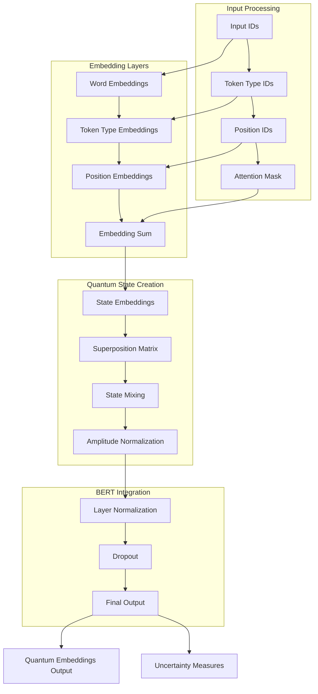
```mermaid
graph TB
    subgraph "Input Processing"
        A[Input IDs] --> B[Token Type IDs]
        B --> C[Position IDs]
        C --> D[Attention Mask]
    end
    
    subgraph "Embedding Layers"
        E[Word Embeddings] --> F[Token Type Embeddings]
        F --> G[Position Embeddings]
        G --> H[Embedding Sum]
    end
    
    subgraph "Quantum State Creation"
        I[State Embeddings] --> J[Superposition Matrix]
        J --> K[State Mixing]
        K --> L[Amplitude Normalization]
    end
    
    subgraph "BERT Integration"
        M[Layer Normalization] --> N[Dropout]
        N --> O[Final Output]
    end
    
    A --> E
    B --> F
    C --> G
    D --> H
    H --> I
    L --> M
    O --> P[Quantum Embeddings Output]
    O --> Q[Uncertainty Measures]
```

**Architecture:**

```python
class QuantumEmbeddings(nn.Module):
    def __init__(self, config=None, vocab_size=None, embedding_dim=None, 
                 num_states=4, superposition_strength=0.5, device=None):
        # Initialize BERT-compatible embedding components
        # Create quantum state matrices
        # Set up superposition mixing
        
    def forward(self, input_ids, token_type_ids=None, position_ids=None, 
                attention_mask=None, context=None, collapse=False):
        # Create superposition states
        # Apply quantum transformations
        # Return enhanced embeddings with uncertainty
```

### 2. **Context Collapse Layers (`qembed/core/collapse_layers.py`)**

Responsible for collapsing superposition states into classical representations.

**Components:**

- **ContextCollapseLayer**: Basic collapse strategies (attention, convolution, RNN)
- **AdaptiveCollapseLayer**: Learns optimal collapse strategies

**Internal Architecture:**

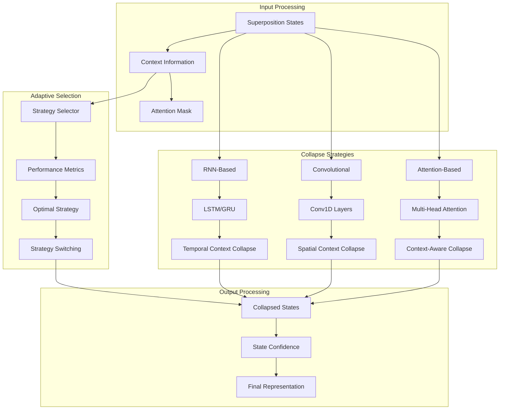
```mermaid
graph TB
    subgraph "Input Processing"
        A[Superposition States] --> B[Context Information]
        B --> C[Attention Mask]
    end
    
    subgraph "Collapse Strategies"
        D[Attention-Based] --> E[Multi-Head Attention]
        E --> F[Context-Aware Collapse]
        
        G[Convolutional] --> H[Conv1D Layers]
        H --> I[Spatial Context Collapse]
        
        J[RNN-Based] --> K[LSTM/GRU]
        K --> L[Temporal Context Collapse]
    end
    
    subgraph "Adaptive Selection"
        M[Strategy Selector] --> N[Performance Metrics]
        N --> O[Optimal Strategy]
        O --> P[Strategy Switching]
    end
    
    subgraph "Output Processing"
        Q[Collapsed States] --> R[State Confidence]
        R --> S[Final Representation]
    end
    
    A --> D
    A --> G
    A --> J
    B --> M
    F --> Q
    I --> Q
    L --> Q
    P --> Q
```

**Architecture:**

```python
class ContextCollapseLayer(nn.Module):
    def __init__(self, strategy='attention'):
        # Initialize collapse strategy
        # Set up attention/convolution/RNN layers
        
    def forward(self, superposition_states, context=None):
        # Apply collapse strategy
        # Return collapsed representation
```

### 3. **Entanglement System (`qembed/core/entanglement.py`)**

Models quantum entanglement between tokens to capture contextual relationships.

**Components:**

- **EntanglementCorrelation**: Base entanglement framework
- **BellStateEntanglement**: Two-token entanglement
- **GHZStateEntanglement**: Multi-token entanglement

**Internal Architecture:**

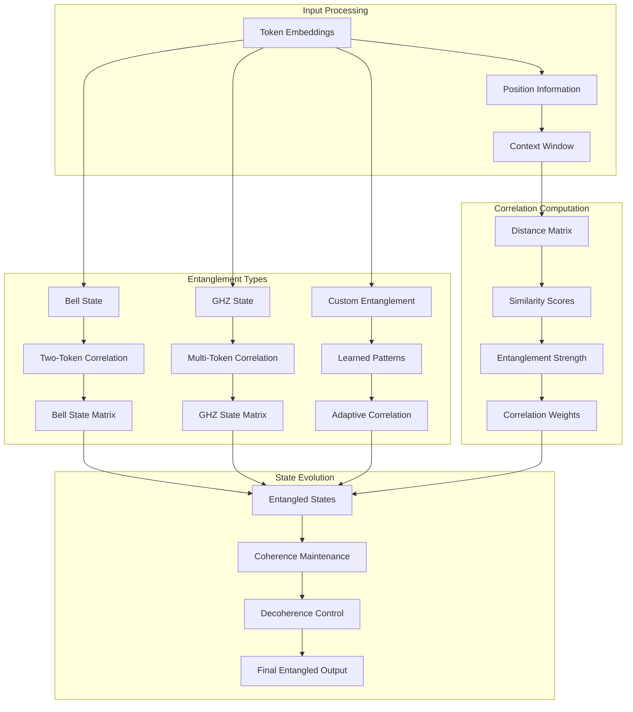
```mermaid
graph TB
    subgraph "Input Processing"
        A[Token Embeddings] --> B[Position Information]
        B --> C[Context Window]
    end
    
    subgraph "Entanglement Types"
        D[Bell State] --> E[Two-Token Correlation]
        E --> F[Bell State Matrix]
        
        G[GHZ State] --> H[Multi-Token Correlation]
        H --> I[GHZ State Matrix]
        
        J[Custom Entanglement] --> K[Learned Patterns]
        K --> L[Adaptive Correlation]
    end
    
    subgraph "Correlation Computation"
        M[Distance Matrix] --> N[Similarity Scores]
        N --> O[Entanglement Strength]
        O --> P[Correlation Weights]
    end
    
    subgraph "State Evolution"
        Q[Entangled States] --> R[Coherence Maintenance]
        R --> S[Decoherence Control]
        S --> T[Final Entangled Output]
    end
    
    A --> D
    A --> G
    A --> J
    C --> M
    F --> Q
    I --> Q
    L --> Q
    P --> Q
```

**Architecture:**

```python
class EntanglementCorrelation(nn.Module):
    def __init__(self, entanglement_type='bell'):
        # Initialize entanglement parameters
        # Set up correlation matrices
        
    def forward(self, token_embeddings):
        # Create entangled states
        # Apply correlation operations
        # Return enhanced representations
```

### 4. **Quantum Measurement (`qembed/core/measurement.py`)**

Handles the final collapse of quantum states into classical outputs.

**Components:**

- **QuantumMeasurement**: Basic measurement operations
- **AdaptiveMeasurement**: Learns optimal measurement bases
- **WeakMeasurement**: Non-destructive measurement
- **POVMMeasurement**: Positive operator-valued measures

**Internal Architecture:**

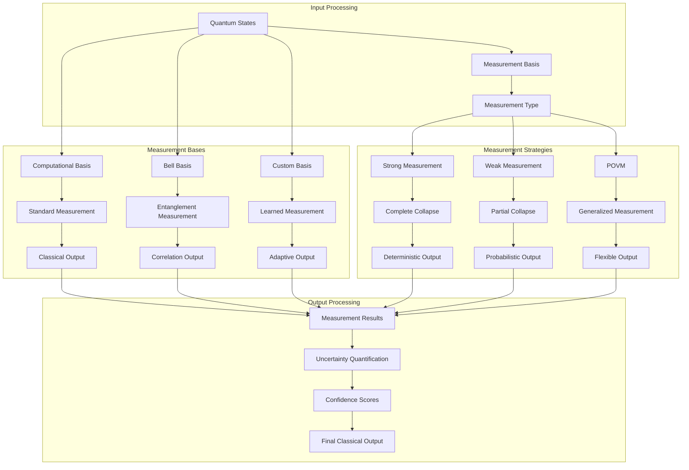
```mermaid
graph TB
    subgraph "Input Processing"
        A[Quantum States] --> B[Measurement Basis]
        B --> C[Measurement Type]
    end
    
    subgraph "Measurement Bases"
        D[Computational Basis] --> E[Standard Measurement]
        E --> F[Classical Output]
        
        G[Bell Basis] --> H[Entanglement Measurement]
        H --> I[Correlation Output]
        
        J[Custom Basis] --> K[Learned Measurement]
        K --> L[Adaptive Output]
    end
    
    subgraph "Measurement Strategies"
        M[Strong Measurement] --> N[Complete Collapse]
        N --> O[Deterministic Output]
        
        P[Weak Measurement] --> Q[Partial Collapse]
        Q --> R[Probabilistic Output]
        
        S[POVM] --> T[Generalized Measurement]
        T --> U[Flexible Output]
    end
    
    subgraph "Output Processing"
        V[Measurement Results] --> W[Uncertainty Quantification]
        W --> X[Confidence Scores]
        X --> Y[Final Classical Output]
    end
    
    A --> D
    A --> G
    A --> J
    C --> M
    C --> P
    C --> S
    F --> V
    I --> V
    L --> V
    O --> V
    R --> V
    U --> V
```

**Architecture:**

```python
class QuantumMeasurement(nn.Module):
    def __init__(self, measurement_basis='computational'):
        # Initialize measurement parameters
        # Set up measurement operators
        
    def forward(self, quantum_states):
        # Apply measurement operators
        # Return classical outputs
        # Provide uncertainty measures
```

## Model Architecture

### 1. **Quantum BERT Models (`qembed/models/quantum_bert.py`)**

BERT-based models enhanced with quantum components.

**Components:**

- **QuantumBertModel**: Base quantum-enhanced BERT
- **QuantumBertForSequenceClassification**: Classification tasks
- **QuantumBertForMaskedLM**: Masked language modeling
- **QuantumBertEmbeddings**: Quantum-enhanced embeddings

**Internal Architecture:**

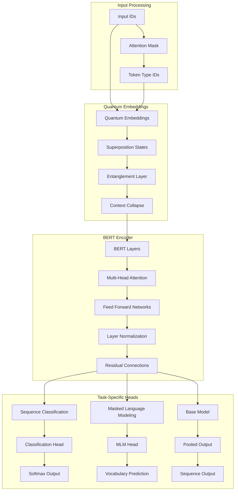
```mermaid
graph TB
    subgraph "Input Processing"
        A[Input IDs] --> B[Attention Mask]
        B --> C[Token Type IDs]
    end
    
    subgraph "Quantum Embeddings"
        D[Quantum Embeddings] --> E[Superposition States]
        E --> F[Entanglement Layer]
        F --> G[Context Collapse]
    end
    
    subgraph "BERT Encoder"
        H[BERT Layers] --> I[Multi-Head Attention]
        I --> J[Feed Forward Networks]
        J --> K[Layer Normalization]
        K --> L[Residual Connections]
    end
    
    subgraph "Task-Specific Heads"
        M[Sequence Classification] --> N[Classification Head]
        N --> O[Softmax Output]
        
        P[Masked Language Modeling] --> Q[MLM Head]
        Q --> R[Vocabulary Prediction]
        
        S[Base Model] --> T[Pooled Output]
        T --> U[Sequence Output]
    end
    
    A --> D
    C --> D
    G --> H
    L --> M
    L --> P
    L --> S
```

**Architecture:**

```python
class QuantumBertModel(QuantumBertPreTrainedModel):
    def __init__(self, config):
        # Initialize BERT backbone
        # Add quantum components
        # Set up quantum embeddings
        
    def forward(self, input_ids, attention_mask=None, **kwargs):
        # Apply quantum embeddings
        # Process through BERT layers
        # Apply quantum measurement
        # Return enhanced outputs
```

### 2. **Quantum Transformer (`qembed/models/quantum_transformer.py`)**

Custom transformer architecture with quantum enhancements.

**Components:**

- **QuantumTransformer**: Main transformer model
- **QuantumTransformerEmbeddings**: Quantum-enhanced embeddings
- **QuantumTransformerLayer**: Quantum-enhanced transformer layers
- **QuantumMultiHeadAttention**: Quantum-enhanced attention mechanism

**Internal Architecture:**

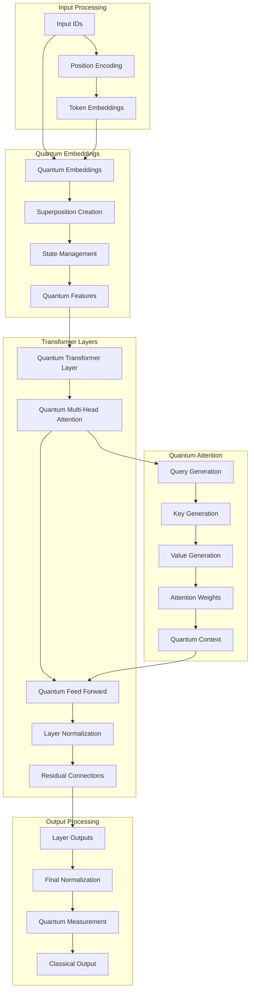
```mermaid
graph TB
    subgraph "Input Processing"
        A[Input IDs] --> B[Position Encoding]
        B --> C[Token Embeddings]
    end
    
    subgraph "Quantum Embeddings"
        D[Quantum Embeddings] --> E[Superposition Creation]
        E --> F[State Management]
        F --> G[Quantum Features]
    end
    
    subgraph "Transformer Layers"
        H[Quantum Transformer Layer] --> I[Quantum Multi-Head Attention]
        I --> J[Quantum Feed Forward]
        J --> K[Layer Normalization]
        K --> L[Residual Connections]
    end
    
    subgraph "Quantum Attention"
        M[Query Generation] --> N[Key Generation]
        N --> O[Value Generation]
        O --> P[Attention Weights]
        P --> Q[Quantum Context]
    end
    
    subgraph "Output Processing"
        R[Layer Outputs] --> S[Final Normalization]
        S --> T[Quantum Measurement]
        T --> U[Classical Output]
    end
    
    A --> D
    C --> D
    G --> H
    L --> R
    I --> M
    Q --> J
```

**Architecture:**

```python
class QuantumTransformer(nn.Module):
    def __init__(self, config):
        # Initialize transformer components
        # Add quantum enhancements
        # Set up quantum attention
        
    def forward(self, input_ids, attention_mask=None):
        # Apply quantum embeddings
        # Process through quantum layers
        # Return enhanced representations
```

### 3. **Hybrid Models (`qembed/models/hybrid_models.py`)**

Combines classical and quantum components for optimal performance.

**Components:**

- **HybridModel**: Main hybrid architecture
- **HybridEmbeddingLayer**: Classical + quantum embeddings
- **HybridAttention**: Classical + quantum attention
- **HybridTransformerLayer**: Classical + quantum transformer layers

**Internal Architecture:**

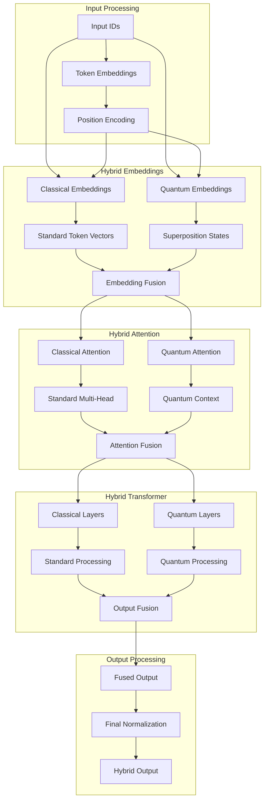
```mermaid
graph TB
    subgraph "Input Processing"
        A[Input IDs] --> B[Token Embeddings]
        B --> C[Position Encoding]
    end
    
    subgraph "Hybrid Embeddings"
        D[Classical Embeddings] --> E[Standard Token Vectors]
        F[Quantum Embeddings] --> G[Superposition States]
        E --> H[Embedding Fusion]
        G --> H
    end
    
    subgraph "Hybrid Attention"
        I[Classical Attention] --> J[Standard Multi-Head]
        K[Quantum Attention] --> L[Quantum Context]
        J --> M[Attention Fusion]
        L --> M
    end
    
    subgraph "Hybrid Transformer"
        N[Classical Layers] --> O[Standard Processing]
        P[Quantum Layers] --> Q[Quantum Processing]
        O --> R[Output Fusion]
        Q --> R
    end
    
    subgraph "Output Processing"
        S[Fused Output] --> T[Final Normalization]
        T --> U[Hybrid Output]
    end
    
    A --> D
    A --> F
    C --> D
    C --> F
    H --> I
    H --> K
    M --> N
    M --> P
    R --> S
```

**Architecture:**

```python
class HybridModel(nn.Module):
    def __init__(self, config):
        # Initialize classical components
        # Add quantum enhancements
        # Set up hybrid layers
        
    def forward(self, input_ids, attention_mask=None):
        # Apply hybrid embeddings
        # Process through hybrid layers
        # Return enhanced outputs
```

## Training Framework

### 1. **Quantum Trainer (`qembed/training/quantum_trainer.py`)**

Specialized training loop for quantum-enhanced models.

**Key Features:**

- **Superposition Scheduling**: Dynamic adjustment of superposition states
- **Entanglement Training**: Specialized training for entanglement parameters
- **Uncertainty Regularization**: Regularization based on quantum uncertainty
- **Quantum-Aware Validation**: Validation considering quantum properties

**Internal Architecture:**

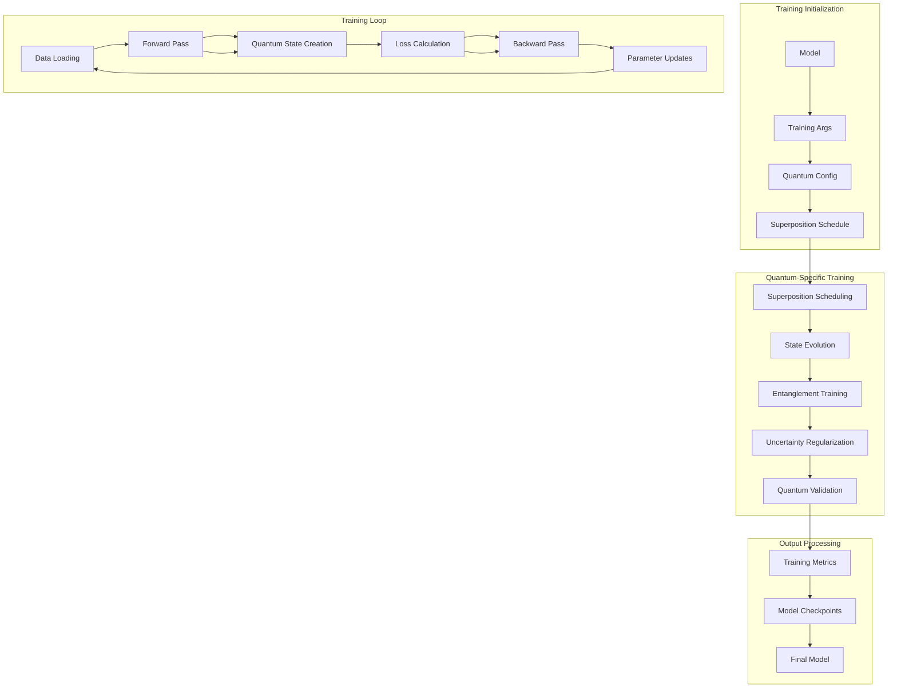
```mermaid
graph TB
    subgraph "Training Initialization"
        A[Model] --> B[Training Args]
        B --> C[Quantum Config]
        C --> D[Superposition Schedule]
    end
    
    subgraph "Training Loop"
        E[Data Loading] --> F[Forward Pass]
        F --> G[Quantum State Creation]
        G --> H[Loss Calculation]
        H --> I[Backward Pass]
        I --> J[Parameter Updates]
    end
    
    subgraph "Quantum-Specific Training"
        K[Superposition Scheduling] --> L[State Evolution]
        L --> M[Entanglement Training]
        M --> N[Uncertainty Regularization]
        N --> O[Quantum Validation]
    end
    
    subgraph "Output Processing"
        P[Training Metrics] --> Q[Model Checkpoints]
        Q --> R[Final Model]
    end
    
    D --> K
    F --> G
    H --> I
    J --> E
    O --> P
```

**Architecture:**

```python
class QuantumTrainer:
    def __init__(self, model, training_args):
        # Initialize training components
        # Set up quantum-specific training
        
    def train(self):
        # Apply superposition schedules
        # Train entanglement parameters
        # Apply uncertainty regularization
        # Return training results
```

### 2. **Quantum Loss Functions (`qembed/training/losses.py`)**

Loss functions designed for quantum-enhanced models.

**Components:**

- **QuantumLoss**: Base quantum loss framework
- **SuperpositionLoss**: Loss for superposition states
- **EntanglementLoss**: Loss for entanglement parameters
- **UncertaintyLoss**: Loss for uncertainty quantification

**Internal Architecture:**

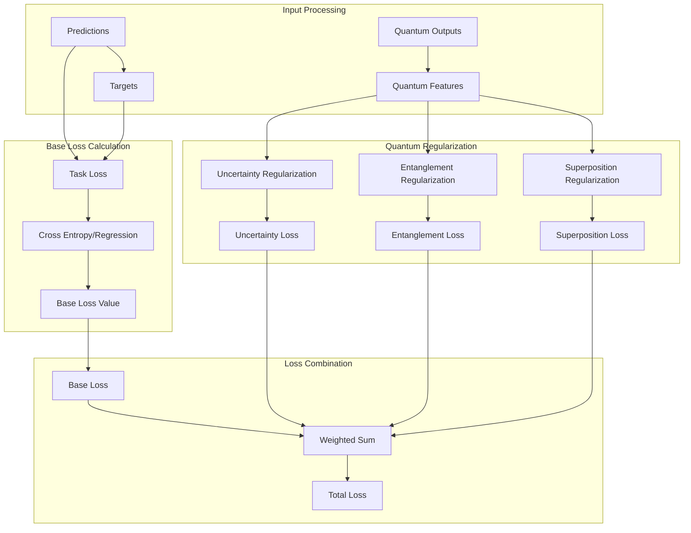
```mermaid
graph TB
    subgraph "Input Processing"
        A[Predictions] --> B[Targets]
        C[Quantum Outputs] --> D[Quantum Features]
    end
    
    subgraph "Base Loss Calculation"
        E[Task Loss] --> F[Cross Entropy/Regression]
        F --> G[Base Loss Value]
    end
    
    subgraph "Quantum Regularization"
        H[Uncertainty Regularization] --> I[Uncertainty Loss]
        J[Entanglement Regularization] --> K[Entanglement Loss]
        L[Superposition Regularization] --> M[Superposition Loss]
    end
    
    subgraph "Loss Combination"
        N[Base Loss] --> O[Weighted Sum]
        I --> O
        K --> O
        M --> O
        O --> P[Total Loss]
    end
    
    A --> E
    B --> E
    D --> H
    D --> J
    D --> L
    G --> N
```

**Architecture:**

```python
class QuantumLoss(nn.Module):
    def __init__(self, base_loss, quantum_weight=0.1, uncertainty_weight=0.05, 
                 entanglement_weight=0.02):
        # Initialize base loss function
        # Set up quantum regularization weights
        
    def forward(self, predictions, targets, quantum_outputs=None):
        # Calculate classical loss
        # Add quantum regularization terms
        # Return total loss with quantum components
```

### 3. **Quantum Optimizers (`qembed/training/optimizers.py`)**

Optimization algorithms designed for quantum parameters.

**Components:**

- **QuantumOptimizer**: Base quantum optimizer
- **SuperpositionOptimizer**: Optimizes superposition parameters
- **EntanglementOptimizer**: Optimizes entanglement parameters

**Internal Architecture:**

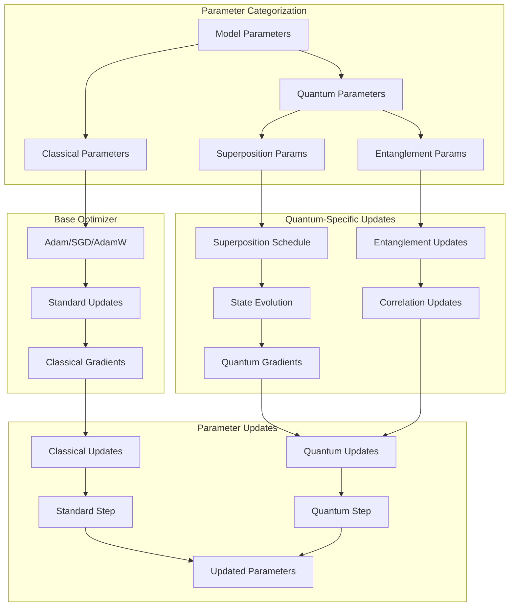
```mermaid
graph TB
    subgraph "Parameter Categorization"
        A[Model Parameters] --> B[Quantum Parameters]
        A --> C[Classical Parameters]
        B --> D[Superposition Params]
        B --> E[Entanglement Params]
    end
    
    subgraph "Base Optimizer"
        F[Adam/SGD/AdamW] --> G[Standard Updates]
        G --> H[Classical Gradients]
    end
    
    subgraph "Quantum-Specific Updates"
        I[Superposition Schedule] --> J[State Evolution]
        J --> K[Quantum Gradients]
        L[Entanglement Updates] --> M[Correlation Updates]
    end
    
    subgraph "Parameter Updates"
        N[Classical Updates] --> O[Standard Step]
        P[Quantum Updates] --> Q[Quantum Step]
        O --> R[Updated Parameters]
        Q --> R
    end
    
    C --> F
    D --> I
    E --> L
    H --> N
    K --> P
    M --> P
```

**Architecture:**

```python
class QuantumOptimizer(optim.Optimizer):
    def __init__(self, params, base_optimizer="adam", base_lr=1e-4, 
                 quantum_lr_multiplier=1.0, superposition_schedule="linear", 
                 entanglement_update_freq=10):
        # Initialize base optimizer
        # Set up quantum-specific parameters
        # Categorize quantum vs classical parameters
        
    def step(self, closure=None):
        # Update quantum state
        # Apply base optimizer step
        # Apply quantum-specific updates
        # Return optimization results
```

## Data Pipeline

### 1. **Specialized Datasets (`qembed/datasets/polysemy_datasets.py`)**

Datasets designed for polysemy and word sense disambiguation tasks.

**Components:**

- **PolysemyDataset**: Base polysemy dataset
- **WordSenseDisambiguationDataset**: WSD-specific dataset

**Internal Architecture:**

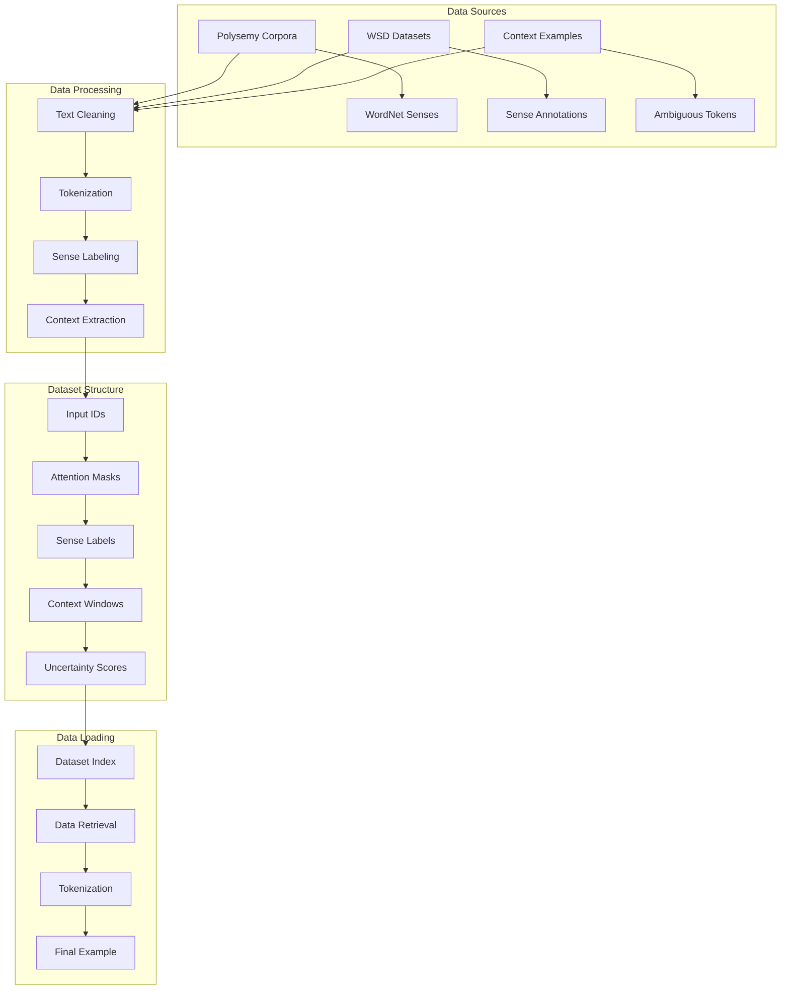
```mermaid
graph TB
    subgraph "Data Sources"
        A[Polysemy Corpora] --> B[WordNet Senses]
        C[WSD Datasets] --> D[Sense Annotations]
        E[Context Examples] --> F[Ambiguous Tokens]
    end
    
    subgraph "Data Processing"
        G[Text Cleaning] --> H[Tokenization]
        H --> I[Sense Labeling]
        I --> J[Context Extraction]
    end
    
    subgraph "Dataset Structure"
        K[Input IDs] --> L[Attention Masks]
        L --> M[Sense Labels]
        M --> N[Context Windows]
        N --> O[Uncertainty Scores]
    end
    
    subgraph "Data Loading"
        P[Dataset Index] --> Q[Data Retrieval]
        Q --> R[Tokenization]
        R --> S[Final Example]
    end
    
    A --> G
    C --> G
    E --> G
    J --> K
    O --> P
```

**Architecture:**

```python
class PolysemyDataset(Dataset):
    def __init__(self, data_path, tokenizer):
        # Load polysemy data
        # Set up tokenization
        
    def __getitem__(self, idx):
        # Return tokenized example
        # Include sense annotations
```

### 2. **Quantum Data Loaders (`qembed/datasets/quantum_data_loaders.py`)**

Data loaders with quantum-aware batching and augmentation.

**Components:**

- **QuantumDataLoader**: Quantum-aware data loading
- **UncertaintyDataLoader**: Uncertainty-based sampling

**Internal Architecture:**

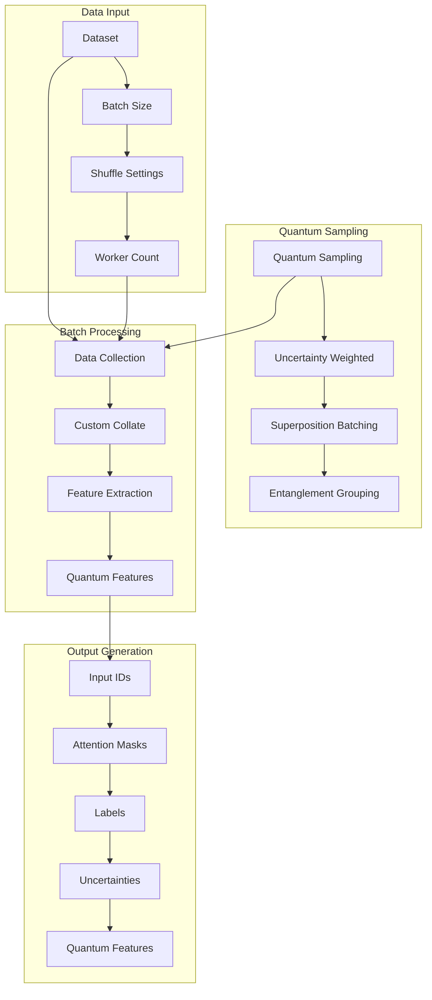
```mermaid
graph TB
    subgraph "Data Input"
        A[Dataset] --> B[Batch Size]
        B --> C[Shuffle Settings]
        C --> D[Worker Count]
    end
    
    subgraph "Quantum Sampling"
        E[Quantum Sampling] --> F[Uncertainty Weighted]
        F --> G[Superposition Batching]
        G --> H[Entanglement Grouping]
    end
    
    subgraph "Batch Processing"
        I[Data Collection] --> J[Custom Collate]
        J --> K[Feature Extraction]
        K --> L[Quantum Features]
    end
    
    subgraph "Output Generation"
        M[Input IDs] --> N[Attention Masks]
        N --> O[Labels]
        O --> P[Uncertainties]
        P --> Q[Quantum Features]
    end
    
    A --> I
    D --> I
    E --> I
    L --> M
```

**Architecture:**

```python
class QuantumDataLoader(DataLoader):
    def __init__(self, dataset, **kwargs):
        # Initialize data loader
        # Set up quantum-aware sampling
        
    def __iter__(self):
        # Apply quantum-aware batching
        # Return enhanced batches
```

## Evaluation System

### 1. **Base Evaluation Framework (`qembed/evaluation/base_evaluator.py`)**

Foundation for all evaluation components.

**Components:**

- **BaseEvaluator**: Abstract base class
- **EvaluationMetrics**: Common evaluation metrics

**Internal Architecture:**

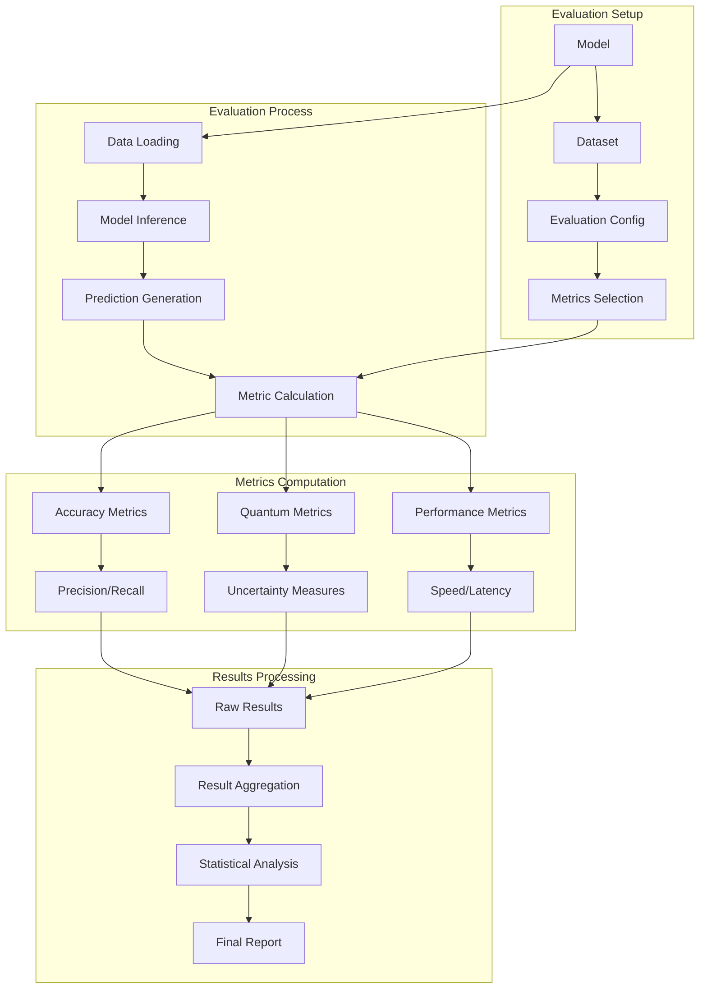
```mermaid
graph TB
    subgraph "Evaluation Setup"
        A[Model] --> B[Dataset]
        B --> C[Evaluation Config]
        C --> D[Metrics Selection]
    end
    
    subgraph "Evaluation Process"
        E[Data Loading] --> F[Model Inference]
        F --> G[Prediction Generation]
        G --> H[Metric Calculation]
    end
    
    subgraph "Metrics Computation"
        I[Accuracy Metrics] --> J[Precision/Recall]
        K[Quantum Metrics] --> L[Uncertainty Measures]
        M[Performance Metrics] --> N[Speed/Latency]
    end
    
    subgraph "Results Processing"
        O[Raw Results] --> P[Result Aggregation]
        P --> Q[Statistical Analysis]
        Q --> R[Final Report]
    end
    
    A --> E
    D --> H
    H --> I
    H --> K
    H --> M
    J --> O
    L --> O
    N --> O
```

**Architecture:**

```python
class BaseEvaluator(ABC):
    @abstractmethod
    def evaluate(self, model, dataset):
        # Evaluate model performance
        # Return evaluation results
```

### 2. **Task-Specific Evaluators**

Specialized evaluators for different NLP tasks.

**Components:**

- **ClassificationEvaluator**: Sequence classification evaluation
- **MLMEvaluator**: Masked language modeling evaluation
- **EmbeddingEvaluator**: Embedding quality evaluation

### 3. **Quantum Analysis Tools**

Tools for analyzing quantum properties of models.

**Components:**

- **QuantumEvaluation**: Quantum property evaluation
- **UncertaintyAnalyzer**: Uncertainty analysis
- **SuperpositionAnalyzer**: Superposition state analysis

## Utility Infrastructure

### 1. **Quantum Utilities (`qembed/utils/quantum_utils.py`)**

Core quantum computing utilities and calculations.

**Features:**

- Quantum state manipulation
- Entanglement calculations
- Measurement operations
- Quantum circuit simulation

**Internal Architecture:**


```mermaid
graph TB
    subgraph "Quantum State Operations"
        A[State Vectors] --> B[State Manipulation]
        B --> C[Superposition Creation]
        C --> D[State Evolution]
    end
    
    subgraph "Entanglement Calculations"
        E[Correlation Matrices] --> F[Bell State Creation]
        F --> G[GHZ State Generation]
        G --> H[Entanglement Measures]
    end
    
    subgraph "Measurement Operations"
        I[Measurement Bases] --> J[Projection Operators]
        J --> K[Measurement Outcomes]
        K --> L[Uncertainty Calculation]
    end
    
    subgraph "Circuit Simulation"
        M[Quantum Gates] --> N[Circuit Construction]
        N --> O[State Evolution]
        O --> P[Final States]
    end
    
    A --> B
    E --> F
    I --> J
    M --> N
```

### 2. **Metrics and Analysis (`qembed/utils/metrics.py`)**

Comprehensive evaluation metrics and analysis tools.

**Features:**

- Classical NLP metrics
- Quantum-specific metrics
- Uncertainty quantification
- Performance analysis

**Internal Architecture:**

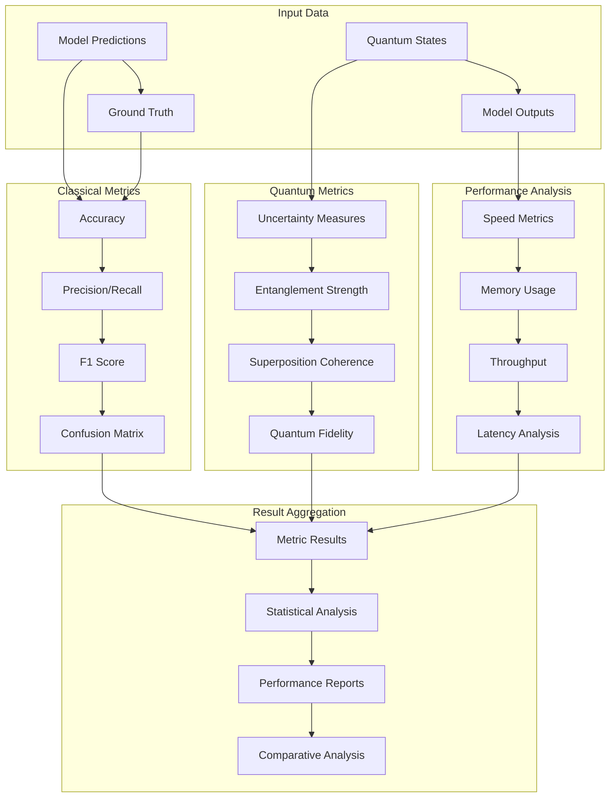
```mermaid
graph TB
    subgraph "Input Data"
        A[Model Predictions] --> B[Ground Truth]
        C[Quantum States] --> D[Model Outputs]
    end
    
    subgraph "Classical Metrics"
        E[Accuracy] --> F[Precision/Recall]
        F --> G[F1 Score]
        G --> H[Confusion Matrix]
    end
    
    subgraph "Quantum Metrics"
        I[Uncertainty Measures] --> J[Entanglement Strength]
        J --> K[Superposition Coherence]
        K --> L[Quantum Fidelity]
    end
    
    subgraph "Performance Analysis"
        M[Speed Metrics] --> N[Memory Usage]
        N --> O[Throughput]
        O --> P[Latency Analysis]
    end
    
    subgraph "Result Aggregation"
        Q[Metric Results] --> R[Statistical Analysis]
        R --> S[Performance Reports]
        S --> T[Comparative Analysis]
    end
    
    A --> E
    B --> E
    C --> I
    D --> M
    H --> Q
    L --> Q
    P --> Q
```

### 3. **Visualization Tools (`qembed/utils/visualization.py`)**

Tools for visualizing quantum properties and training progress.

**Features:**

- Quantum state visualization
- Training progress plots
- Uncertainty heatmaps
- Entanglement networks

**Internal Architecture:**

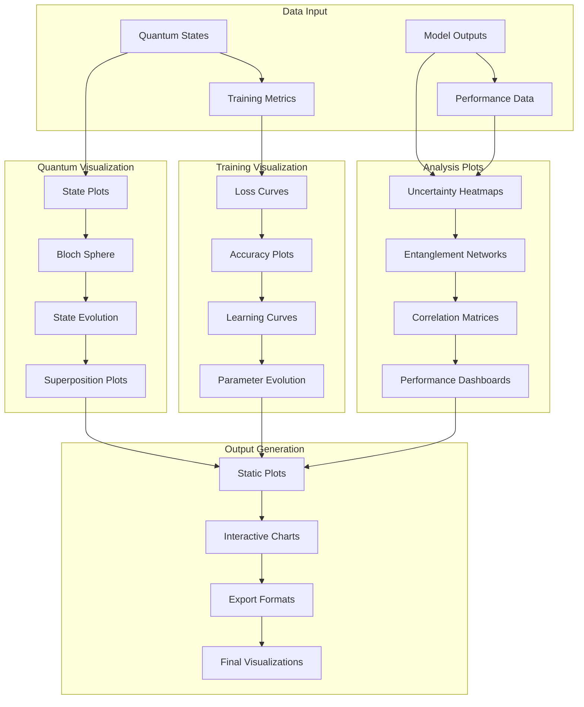
```mermaid
graph TB
    subgraph "Data Input"
        A[Quantum States] --> B[Training Metrics]
        C[Model Outputs] --> D[Performance Data]
    end
    
    subgraph "Quantum Visualization"
        E[State Plots] --> F[Bloch Sphere]
        F --> G[State Evolution]
        G --> H[Superposition Plots]
    end
    
    subgraph "Training Visualization"
        I[Loss Curves] --> J[Accuracy Plots]
        J --> K[Learning Curves]
        K --> L[Parameter Evolution]
    end
    
    subgraph "Analysis Plots"
        M[Uncertainty Heatmaps] --> N[Entanglement Networks]
        N --> O[Correlation Matrices]
        O --> P[Performance Dashboards]
    end
    
    subgraph "Output Generation"
        Q[Static Plots] --> R[Interactive Charts]
        R --> S[Export Formats]
        S --> T[Final Visualizations]
    end
    
    A --> E
    B --> I
    C --> M
    D --> M
    H --> Q
    L --> Q
    P --> Q
```

## Integration Points

### 1. **Hugging Face Transformers**

**Integration Strategy:**

- Inherit from Hugging Face base classes
- Maintain API compatibility
- Add quantum enhancements seamlessly
- Support for model sharing and loading

**Key Benefits:**

- Leverage existing model architectures
- Maintain compatibility with existing workflows
- Easy integration with Hugging Face ecosystem

### 2. **PyTorch Ecosystem**

**Integration Strategy:**

- Built on PyTorch foundation
- Leverage PyTorch optimizations
- Support for distributed training
- Integration with PyTorch Lightning

**Key Benefits:**

- Familiar development experience
- Rich ecosystem of tools and libraries
- Excellent performance and scalability

### 3. **Research Tools**

**Integration Strategy:**

- Support for Jupyter notebooks
- Integration with experiment tracking
- Easy debugging and analysis
- Comprehensive logging

## Performance Considerations

### 1. **Computational Complexity**

**Quantum Components:**

- Superposition states: O(n × s) where n = tokens, s = superpositions
- Entanglement: O(n²) for full entanglement, O(n) for local
- Measurement: O(n × m) where m = measurement bases

**Optimization Strategies:**

- Sparse entanglement matrices
- Approximate quantum operations
- Efficient superposition management
- Parallel quantum computations

### 2. **Memory Management**

**Memory Requirements:**

- Superposition states: Additional memory for multiple states
- Entanglement matrices: Quadratic memory for correlations
- Quantum parameters: Additional model parameters

**Optimization Strategies:**

- Gradient checkpointing
- Dynamic memory allocation
- Efficient tensor operations
- Memory-efficient attention

### 3. **Training Efficiency**

**Training Considerations:**

- Quantum parameter initialization
- Learning rate scheduling for quantum components
- Gradient flow through quantum operations
- Convergence of quantum parameters

**Optimization Strategies:**

- Specialized learning rates
- Quantum-aware gradient clipping
- Efficient backpropagation
- Adaptive optimization

## Security & Privacy

### 1. **Model Security**

**Security Considerations:**

- Quantum parameter protection
- Model inversion attacks
- Adversarial examples
- Privacy-preserving training

**Security Measures:**

- Parameter encryption
- Adversarial training
- Differential privacy
- Secure multi-party computation

### 2. **Data Privacy**

**Privacy Considerations:**

- Training data protection
- Inference privacy
- Model sharing security
- Federated learning support

**Privacy Measures:**

- Data anonymization
- Secure aggregation
- Homomorphic encryption
- Privacy-preserving evaluation

## Deployment Architecture

### 1. **Model Serving**

**Deployment Options:**

- REST API services
- gRPC services
- Model containers
- Edge deployment

**Architecture:**

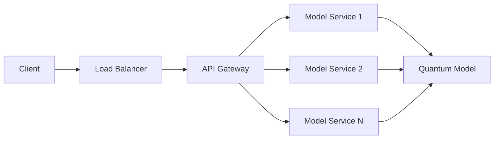
```mermaid
graph LR
    A[Client] --> B[Load Balancer]
    B --> C[API Gateway]
    C --> D[Model Service 1]
    C --> E[Model Service 2]
    C --> F[Model Service N]
    D --> G[Quantum Model]
    E --> G
    F --> G
```

### 2. **Scalability**

**Scaling Strategies:**

- Horizontal scaling of model instances
- Load balancing across services
- Caching and optimization
- Auto-scaling based on demand

### 3. **Monitoring**

**Monitoring Components:**

- Performance metrics
- Quantum property tracking
- Uncertainty monitoring
- Error rate tracking

## Future Architecture

### 1. **Quantum Hardware Integration**

**Future Plans:**

- Integration with quantum computers
- Hybrid quantum-classical algorithms
- Quantum error correction
- Quantum advantage demonstration

### 2. **Advanced Architectures**

**Future Components:**

- Quantum attention mechanisms
- Quantum graph neural networks
- Quantum reinforcement learning
- Quantum federated learning

### 3. **Research Directions**

**Research Areas:**

- Novel quantum-inspired algorithms
- Theoretical foundations
- Performance optimization
- New application domains

## Conclusion

The QEmbed architecture represents a novel approach to natural language processing that combines the power of quantum computing principles with the practical benefits of classical deep learning. The modular design ensures maintainability and extensibility, while the quantum-inspired components provide enhanced capabilities for capturing linguistic uncertainty and polysemy.

The architecture is designed to be:

- **Research-Friendly**: Easy to experiment with new quantum-inspired ideas
- **Production-Ready**: Robust and scalable for real-world applications
- **Community-Driven**: Open to contributions and extensions
- **Future-Proof**: Designed to evolve with advances in quantum computing

This architecture provides a solid foundation for exploring the intersection of quantum computing and natural language processing, while maintaining practical usability and performance.
